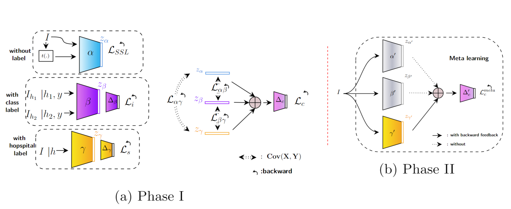
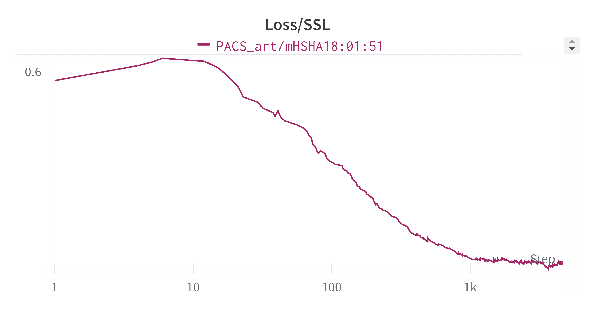
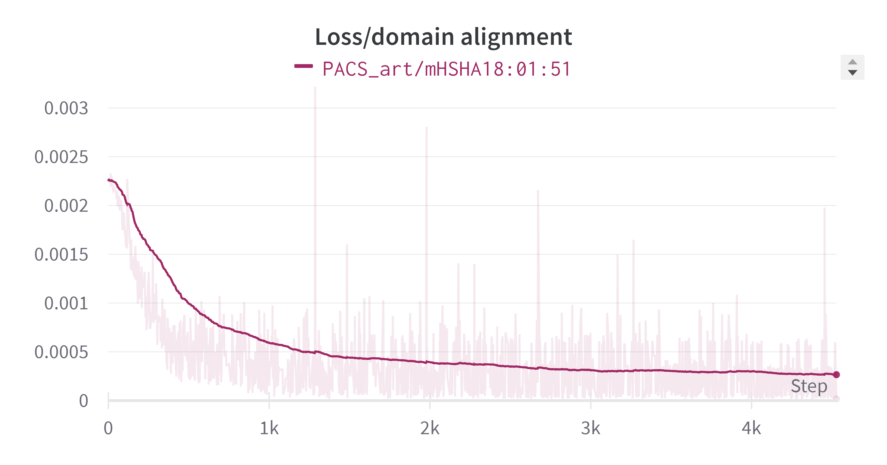
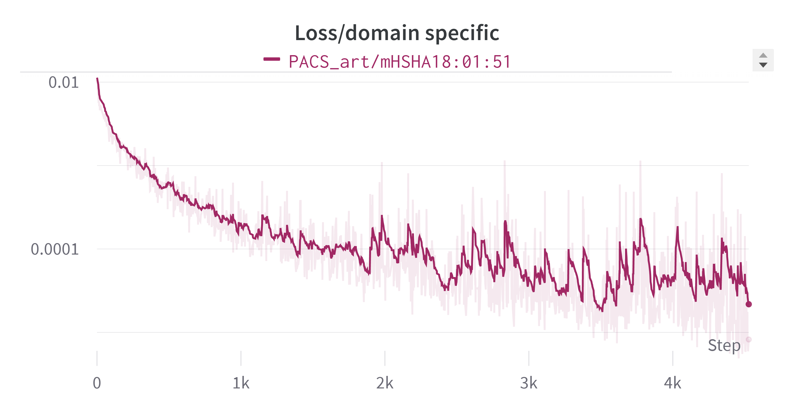
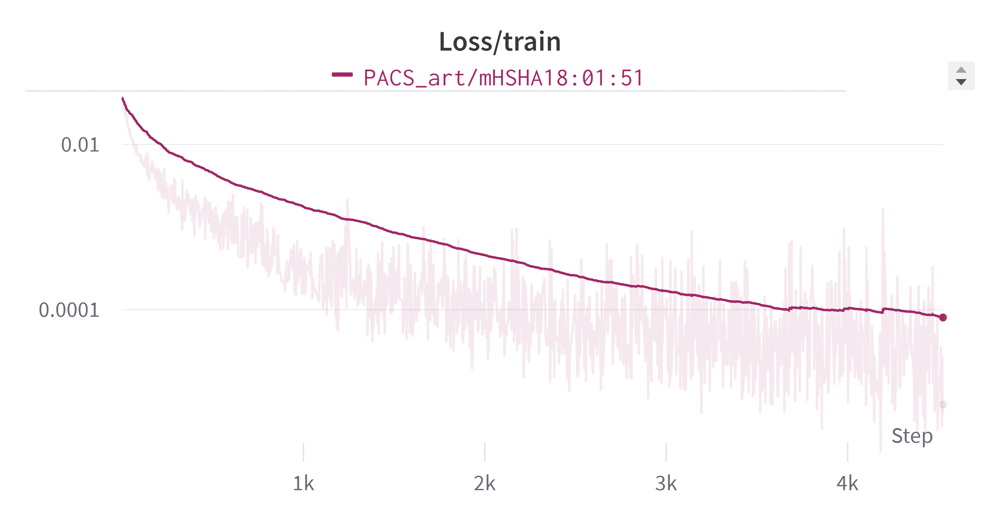

# Exploiting All Levels of Features Abstraction for Improving the Generalization to Unseen Hospitals

## Table of Content

1. [Introduction](#intro)
2. [Guideline](#guideline)
    - [To prepare](#prepare)
    - [To run experiments](#experiments)
    - [To visualize objective functions](#visualize)
    - [To plot feature representations](#plot)
    
## <a name="intro"></a> Introduction


This repository contains the implementation of our "exploting the All Level of Features Abstraction" (ALFA) method for MICCAI 2023. Our approach goes beyond traditional methods by leveraging not only domain-specific features but also incorporating SSL features with the goal of improving DG. Through the integration of SSL, our ALFA method can effectively learn and utilize additional features that are relevant, resulting in improved performance and accuracy. We are excited to present our findings at MICCAI 2023 and share how the ALFA method can advance the field of medical image analysis.




Details of the model and experimental results can be found in the submission:
```bibtex
in progress
```
**Please CITE** our paper if you find it useful in your research.

## <a name="guideline"></a> Guideline
### <a name="prepare"></a> To prepare:
Install prerequisite packages:
```sh
python -m pip install -r requirements.txt
```

Download and unzip the datasets:
```

```


### <a name="experiments"></a> To run experiments:
Run with five different seeds:
```sh
for i in {1..3}; do
     taskset -c <cpu_index> python main.py --config <config_path> --exp_idx $i --gpu_idx <gpu_index>
done
```
where the parameters are the following:
- `<cpu_index>`: CPU index. E.g., `<cpu_index> = "1"`
- `<config_path>`: path stored configuration hyper-parameters. E.g., `<config_path> = "algorithms/mDSDI/configs/PACS_photo.json"`
- `<gpu_index>`: GPU index. E.g., `<gpu_index> = "0"`

**Note:** Select different settings by editing in `/configs/..json`, logging results are stored in `/results/logs/`


### <a name="visualize"></a> To visualize objective functions we have used wandb:

```sh
wandb.log({name_for_the_entity:entity}) 
```

### <a name="Losses plots"></a> Here is the losses plot for the ALFA:









### <a name="plot"></a> To plot feature representations:

```sh
python utils/tSNE_plot.py --plotdir <plotdir>
```
where `<plotdir>`: path stored results to plot. E.g., `<plotdir> = "algorithms/mDSDI/results/plots/PACS_photo_1/"`


**Note:** Results are stored in `/results/plots/`

### <a name="DomainBed"></a> To run on ["DomainBed, Ishaan and David, 2021"](https://github.com/facebookresearch/DomainBed) library:

```sh
cd DomainBed/
python -m domainbed.scripts.train --data_dir=../data/ --algorithm MDSDI --dataset <dataset_name> --test_env <env_idx>
```
where the parameters are the following:
- `<dataset_name>`: name of 5 benchmark datasets, including: RotatedMNIST | VLCS | OfficeHome | PACS | DomainNet. E.g., `<dataset_name> = PACS`
- `<test_env>`: index of the target domain. E.g., `<dataset_name> = 0`


**Note:** Results are stored in `DomainBed/results/train_output/out.txt`

## License

This source code is released under the Apache-2.0 license, included [here](LICENSE).
